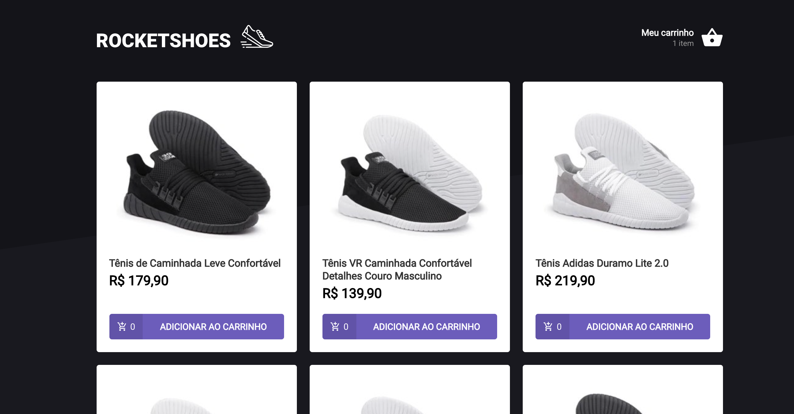

#Desafio Ignite Q3 2021

## Setup

#### git clone https://github.com/vagnerolliver/ignite-challenge-03-creating-hook-shopping-cart

#### Instal dependencies 
$ yarn or npm install

## Run Local

#### terminal 1
$ yarn or npm start

#### terminal 2
$ yarn server  

or

$ npm start

#### Browser
http://localhost:3000

## Tests
$ yarn or npm test

